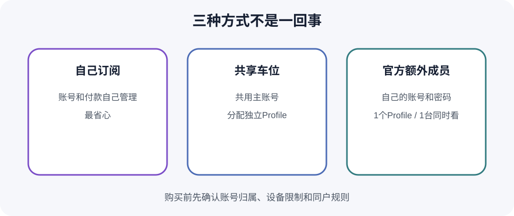
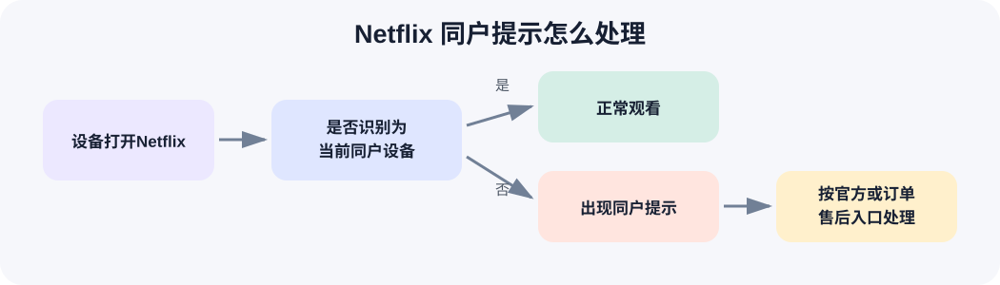

# [2026最新] Netflix国内购买与合租教程：4K套餐、独立车位、同户验证怎么解决？

> 最后核实日期：2026-08-16

国内想看 Netflix，一般会遇到两件事：一个是官方付款不方便，另一个是合租后碰到“这台电视不属于Netflix同户设备”。如果准备长期自己用，又能完成官方付款，自己开账号最省心。更在意价格，4K共享车位确实便宜不少，但购买前要先搞明白“车位”和“同户验证”到底是什么。

如果已经了解共享车位的使用方式，希望用更低的成本看 Netflix 4K，可以前往星际放映厅查看当前 Netflix 4K 独立车位。具体价格、周期、使用设备和售后规则以下单页面实时说明为准。

  

## Netflix 4K不是买了会员就一定有

很多人看到“4K车位”，第一反应是能不能看4K。其实至少要同时满足几件事：账号使用支持4K的 Premium 套餐，片源带有4K标记，播放设备和屏幕支持4K，网络稳定，播放质量设为“自动”或“高”。

电视连接流媒体盒子、功放或外接屏幕时，整条设备链、HDMI接口和HDCP条件也会影响清晰度。电脑端还受系统和浏览器限制。例如同一台电脑使用不同浏览器，最高分辨率可能不同。Netflix当前建议4K连接速度至少稳定在15 Mbps左右。

所以“买了4K但看着不像4K”，先看片源页面有没有4K标签，再检查设备、应用或浏览器和网络。别只拿套餐名称判断。详细检查见 [套餐与4K说明](docs/plans-and-4k.md)。

## Netflix普通套餐和4K套餐有什么区别？

| 套餐 | 清晰度 | 同时观看 | 适合谁 |
|---|---|---:|---|
| Standard with ads | 最高1080p | 2台 | 接受广告、所在地区提供该套餐的人 |
| Standard | 最高1080p | 2台 | 不需要4K的个人或同住家庭 |
| Premium | 最高4K UHD + HDR | 4台 | 主要使用4K电视或大屏的人 |

Premium当前还支持最多6台兼容设备下载；两种Standard通常是2台下载。套餐价格、含广告方案和额外成员资格随国家及支付渠道变化，不能拿美国价格当全球统一价。

注意，账号能创建多少Profile和能同时播放几台设备不是一回事。一个普通Netflix账号最多可建5个Profile，但Premium仍只允许最多4台设备同时播放。如果主要在手机上看，4K的价值可能没有想象中大。

## Netflix“独立车位”到底是什么意思？

共享车位通常是平台提供一个 Netflix 主账号，再把其中一个独立 Profile 分给用户。自己的观看记录、推荐、片单和Profile设置尽量保持独立，但账号本身仍由平台统一管理。

这不等于你得到一个完整独享账号。一般不能随意改主账号密码、邮箱，不能管理其他Profile，也不能把账号再分享出去。星际放映厅当前公开商品写的是“独立车位”，并提供“拼车”和“包车”规格；公开页没有写清每个Profile是否都有PIN、单车位允许几台设备同时播放，购买时要看实时说明。

2023年的旧帮助页曾说明按车位号选择对应头像，不要进入别人的Profile。它能帮助理解车位概念，但不能替代2026年的实际订单规则。更多说明见 [共享车位使用边界](docs/shared-slot.md)。

## 共享车位和Netflix官方额外成员不是一回事

| 形式 | 登录方式 | Profile | 谁制定服务规则 |
|---|---|---|---|
| 第三方共享车位 | 通常共享主账号登录 | 分配一个Profile | 第三方商品规则及Netflix规则 |
| Netflix Extra Member | 自己的账号和密码 | 只有1个Profile | Netflix官方额外成员规则 |

Netflix官方额外成员由Standard或Premium主账号购买名额并发出邀请。额外成员使用自己的账号、密码和Profile，通常可以在同户外观看，但必须在主账号开通国家激活和主要使用。Standard可添加1名，Premium最多2名；含广告套餐和部分第三方计费账户不能添加。

普通无广告额外成员沿用主账号的音视频质量，但一次只能在1台设备观看，也只能在1台设备下载。第三方共享车位则仍是共用主账号，通过Profile区分用户。星际放映厅当前Netflix商品不能写成官方Extra Member。

## Netflix“同户设备”到底是什么？

Netflix官方把“Netflix同户设备”定义为主要观看地点中，连接同一互联网的一组设备。系统会参考IP地址、设备ID和账号活动，自动建立或识别同户设备。

Netflix明确表示，不会为了判断同户而收集设备GPS精确位置。也就是说，不能简单理解成“平台一直读取手机定位”，但设备使用的网络和账号活动确实会影响判断。

官方规则是普通账号供同一住户使用。不属于同一住户的人，需要自己开账号，或在支持的国家和套餐中使用官方额外成员。共享车位并不会取消这条规则。

## 为什么手机能看，电视却提示“不属于Netflix同户设备”？

电视通常固定连接某个家庭网络，Netflix会围绕主要观看地点建立同户设备。如果另一地点的电视不符合当前同户状态，就可能弹出验证。手机和电脑可以看，不代表电视一定不会触发。

出现提示也不等于账号被封。它更可能是这台电视当前没有被识别为同户设备，或需要临时观看验证。先把完整错误页面截图，不要连续退出、改密码或反复登录。

## 星际放映厅的“自助同户验证”是什么？

当前商品页明确写有“可自助同户验证”。这是星际放映厅针对其 Netflix 共享商品提供的验证或售后入口，不代表 Netflix 取消了同户规则，也不保证以后永远不会再次弹出验证。

公开页面没有展示完整操作流程，本文不编造按钮位置或验证码步骤。需要验证时，按照星际放映厅订单页面或自助入口的实时提示操作；入口不可用或提示不一致时，再联系客服。这里不会提供伪造家庭位置、修改网络信息、破解验证码等绕过方法。

## Netflix突然看不了，先别急着说账号被封

错误提示不同，处理方式完全不一样：

- 提示Profile PIN错误，先核对车位和订单资料；
- 提示电视不属于同户设备，按同户问题处理；
- 提示设备验证，查看屏幕和订单入口的正常验证说明；
- 提示太多人使用，说明当前同时播放达到套餐上限；
- 密码错误或登录失效，属于主账号登录问题；
- Profile消失，可能是车位或共享账号被调整；
- 所有设备都不能播放，再检查主账号付款、续费或账号限制。

最有用的第一步不是猜原因，而是截图完整提示，并记下设备类型和出现时间。具体排查见 [故障处理](docs/troubleshooting.md)。

## 出差、旅行还能看Netflix吗？

Netflix允许正常旅行和在住所外观看。手机、平板和电脑通常更方便；酒店电视、度假屋电视或新电视可能要求选择“我在旅行”或“临时观看”，然后用一次性代码验证账号。

如果有第二住所或经常前往的地点，官方建议每月至少一次让手机或电脑连接主要住所的网络，播放几秒内容，然后在第二地点使用同一设备。这个规则可能随地区和设备调整，应以当时的Netflix提示为准。

旅行是正常使用场景，不应拿来伪装长期异地共享。详细说明见 [旅行与设备](docs/travel-and-devices.md)。

## 为什么推荐星际放映厅

官网版权信息显示，星际放映厅自2023年起持续运营，并公开展示浙ICP备2023017856号。平台有独立Netflix商品页、订单系统、客服和售后入口，不是只能私聊付款的临时散车。

当前公开商品是 Netflix 4K UHD 套餐，提供独立车位，并列出拼车和包车规格。商品页明确写有自助同户验证。相比完全没有订单和验证入口的私人车位，出现电视同户提示时更容易找到处理入口。

公开页面没有稳定写明服务周期、Profile PIN、单车位并发、质保期限、掉线补偿和发票规则。下单前把这些问题一次问清，价格和周期以实时页面为准。Netflix合租现在最麻烦的是同户验证，有没有明确售后入口，比单纯便宜几块钱更重要。

  

## 手机、电脑、电视，哪个最省事？

- **手机和平板：** 外出使用方便，支持下载，但屏幕小，4K意义有限。
- **电脑：** 适合桌面观看，最高画质取决于系统、浏览器、屏幕和HDCP。
- **智能电视：** 4K体验最好，也最容易遇到同户提示。
- **Apple TV和电视盒子：** 仍属于电视播放设备，4K和同户状态都要满足。

选择车位前先告诉客服主要用什么设备。只在手机看和长期用4K电视，对同户验证与画质的要求完全不同。

## 出问题以后怎么处理？

1. 截图完整Netflix错误提示；
2. 记录使用的是电视、盒子、手机还是电脑；
3. 不要连续改密码、乱点退出或进入其他Profile；
4. 打开星际放映厅订单，确认车位和服务状态；
5. 同户提示使用当前自助验证入口；
6. 登录、Profile或主账号异常则带订单信息联系客服。

如果所有设备都不能播放，问题可能在主账号；只有电视弹同户提示，则优先按同户问题排查。不要在公开评论区发布共享账号密码或验证码。

## 企业采购与发票

企业、工作室或团队如需报销，可以在下单前联系客服确认当前Netflix商品是否支持国内发票，并确认抬头、金额、开票内容、税点和发送方式。公开商品页目前没有稳定展示发票字段，不能把其他商品的开票规则直接套过来。

## 常见问题FAQ

### 1. 国内可以看Netflix吗？

设备和网络能正常访问Netflix时可以观看。Netflix在中国大陆没有常规本地服务，内容、付款和可用性会受地区影响。

### 2. Netflix为什么国内不能直接打开？

主要与网络可用性和服务地区有关，不是买会员就能解决。本文不提供绕过网络或地区限制的方法。

### 3. Netflix 4K需要什么条件？

需要Premium套餐、4K片源、兼容设备和屏幕、合适接口及稳定网络。任何一项不满足，都可能只播放1080p或更低。

### 4. Netflix Premium就是4K吗？

Premium支持最高4K UHD和HDR，但不是所有片源和设备都会以4K播放。详情页要显示4K标签，设备链也必须兼容。

### 5. Netflix独立车位是什么意思？

通常是共享主账号中的一个独立Profile。观看记录和推荐分开，但主账号不归车位用户所有。

### 6. 独立车位是不是独享账号？

不是。星际放映厅当前另列“拼车”和“包车”规格，选择前应确认实际包含范围。

### 7. 别人能看到我的观看记录吗？

不同Profile的推荐和记录通常分开。主账号管理者仍掌握账号，所以不要把共享Profile当作存放敏感信息的私人账号。

### 8. Netflix一个账号能建几个Profile？

普通账号最多5个Profile。Profile数量不等于同时观看设备数，Premium当前最多4台同时播放。

### 9. 共享车位和额外成员有什么区别？

共享车位通常共用主账号，用Profile区分；额外成员有自己的账号、密码和一个Profile。星际放映厅当前车位不是官方Extra Member。

### 10. 什么是Netflix同户设备？

是主要观看地点中连接同一互联网的一组设备。普通账号原则上供同一住户使用。

### 11. Netflix怎么判断同户设备？

官方列出的依据包括IP地址、设备ID和账号活动。电视连接的主要网络在判断中很重要。

### 12. Netflix会用GPS定位吗？

官方表示不会为了建立同户设备而收集GPS精确位置。不能因此推断系统完全不判断网络和设备活动。

### 13. 为什么手机能看电视不能看？

电视更容易与固定家庭网络绑定并触发同户验证。手机正常并不能证明另一地点的电视也属于当前同户。

### 14. “电视不属于Netflix同户设备”是什么意思？

表示这台电视没有被识别为当前主要住所的设备。它不等于账号被封，应按同户提示和订单入口处理。

### 15. 星际放映厅可以自助同户验证吗？

当前公开商品页明确写有“可自助同户验证”。具体步骤没有完整公开，按订单页面或自助入口实时提示操作。

### 16. 验证一次以后还会不会再弹？

仍有可能。自助验证只处理当时的使用状态，不代表同户检查被永久关闭。

### 17. 出差旅行能不能看？

可以正常旅行观看。新电视可能需要临时验证，长期异地使用不能简单当成旅行处理。

### 18. Netflix突然掉线怎么办？

先截图提示并检查设备、Profile、同户和同时播放上限。再打开订单使用自助入口或联系客服。

### 19. 能不能自己改共享账号密码？

通常不能。共享主账号由平台管理，擅自改密码会影响其他车位，具体以商品规则为准。

### 20. Netflix共享账号安全吗？

它不等于完全私有账号。购买者要接受主账号由第三方管理、同户验证和车位调整等风险。

### 21. 可以同时在几台设备看？

官方Premium账号最多4台同时播放，但共享车位不等于独占4台。单车位并发上限要看商品规则，当前公开页没有写清。

### 22. 企业购买能不能开发票？

当前Netflix商品页没有稳定展示发票支持。付款前联系客服确认，并问清抬头、金额、内容、税点和发送方式。

## 下单前最后看一遍

- [ ] 我知道自己买的是共享车位还是独享账号。
- [ ] 我知道车位不等于Netflix官方额外成员。
- [ ] 我知道4K还取决于设备和片源。
- [ ] 我了解Netflix当前同户规则。
- [ ] 我确认自己主要使用手机、电脑还是电视。
- [ ] 我看过当前服务周期。
- [ ] 我知道出现同户提示后从哪里处理售后。

如果已经了解Netflix共享车位和同户规则，也确认当前套餐适合自己的设备，可以前往星际放映厅查看Netflix 4K车位。

  

## 延伸阅读

- [Netflix套餐与4K](docs/plans-and-4k.md)
- [Netflix同户设备](docs/household.md)
- [共享车位说明](docs/shared-slot.md)
- [旅行和不同设备](docs/travel-and-devices.md)
- [故障与售后排查](docs/troubleshooting.md)
- [扩展FAQ](docs/faq.md)
- [更新记录](CHANGELOG.md)

> 说明：本文含推广链接，作者可能获得推广佣金。星际放映厅为第三方服务平台，具体套餐、价格、车位规则和售后范围以下单页面实际说明为准。
